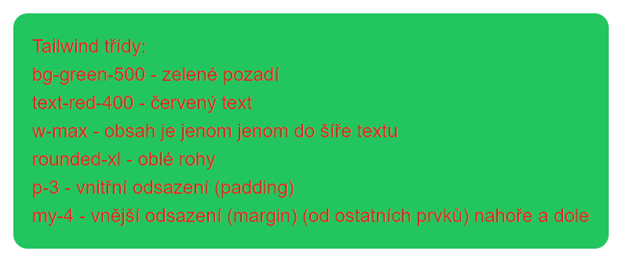
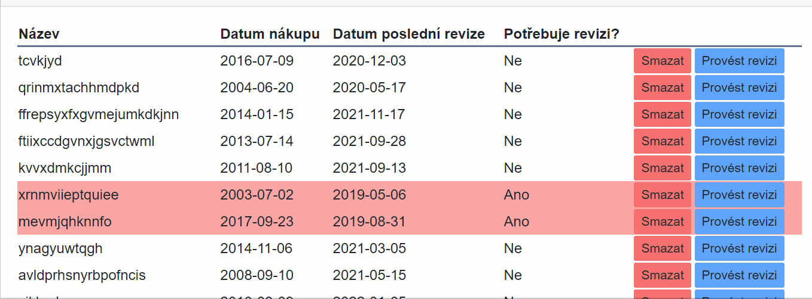

# PPT nemocnice

## Jak Blazor aplikace funguje?

### Všechno začíná v souboru `index.html`

- neplést s `Index.razor`.
- statický soubor, který je načten při startu aplikace (/index je to samé jako / )
- v elementu `<head>` načítá csska, nastavuje titulek, meta tagy, atd...
- vlastní stránka je v elementu `<body>`
- v `<body>` jsou i skripty. Pro běh Blazor aplikace je důležité načíst:

```html
<script src="_framework/blazor.webassembly.js"></script>
```

- `blazor.webassebly.js` je zodpovědný za načtení `.dll` souborů a spuštění .net aplikace. Ve finále vymění obsah divu: `<div id="app">` za komponentou `App.razor`

### App.razor - startovací bod pro běh aplikace

- Obsahuje komponentu `<Router>`, s vlastností `AppAssembly="@typeof(App).Assembly"` -> "V sestavení (assembly) stejného typu jako je třída `App` hledej stránky".
- Když stránku nalzne (například `/counter`), zobrazí se `RouteView` (v podstatě stránka (komponenta obsahující direktivu `@page`(`Index.razor`,`Counter.razor`)))
- Když stránka nalezena není. Zobrazí se to co je v komponentě `<NotFound>`.
- `RouteView` má vlastnost `DefaultLayout="@typeof(MainLayout)"`. Čímž nám říká, že pro zobrazení stránek se použije layout `MainLayout.razor`.

### Program.cs

- První c# kód, který se spustí po načtení.
- Obsahuje nastavení celé aplikace. 
  - `builder.RootComponents.Add<App>("#app");` -> vyměň element s `id=app` za komponentu typu `App`.
- Všimněte si zjednodušení c# syntaxe (většinou novinka z .net 6 a c# 9/10)
  - Top level namespace; class, metoda main
  - (za oponou je všechno přidáno do Main metody třídy Program (ale nejmenují se tak ))
  - https://docs.microsoft.com/en-us/dotnet/core/tutorials/top-level-templates
  - https://code-maze.com/csharp-top-level-statements/


### MainLayout.razor

- Obsahuje rozložení stránky (levý sloupec s navigací, hlavičku (header neplést s `<head>`) ).
- Vlastnost `@Body` -> Tam se vygeneruje stránka na kterou uživ. vstoupil.
- Umožňuje mít stejný Layout, aniž byste neustále opakovili stejné prvky. 

### Úlohy

- Změňte favicon na jakýkoliv (vámi zvolený ) `<link rel="icon" type="image/x-icon" href="jakýkolivObrázek.png">`
- Změňte odkaz About (pravý horní roh) na FBMI odkazující na fakultní web.
- Přidejte stránku `Vybavení nemocnice` a společně s ní i odkaz do menu.
  - (Zde budeme posléze seznam vybavení nemocnice)
- Změňte text `Loading…` na něco jiného.
- Pokud uživatel vstoupí na stránku, kterou aplikace nemá. Zobrazte chybovou hlášku a přidejte odkaz na návrat na index. 


## CSS, Bootstrap, Tailwind CSS

### CSS

- Jednoduše můžete ostylovat element přidáním vlastnosti `style`:

```html
<h1 style="background-color:red">Vítej v nemocnici!</h1>
```

- S přibývajícím množstvím úprav se to stává nepřiměřeně komplikované. Navíc není možné znovu použít jeden styl.
- Řešením je odhrnout stylování do samostatného souboru (.css - cascading style sheet) a použít nějaký ukazatel (třídu)

```html
<h1 class="nadpis">Vítej v nemocnici!</h1>
```

.css soubor:

```css
.nadpis
{
    background-color:red;
}
```

### Bootstrap

- Rozumné množství opakujících se znovupoužitelných tříd.
- https://getbootstrap.com/docs/5.0/components/buttons/
- Například třídy pro tlačítko: `btn btn-primary` (tyto 2 třídy skrývají cca 20 vlastností, viz F12)
- Zařídí podporu pro všechny* prohlížeče
  - Klasicky ne všechny css vlastnosti jsou u všech prohlížečů stejně implementovány.
- Výrazně zjednodušuje práci především pro ne-frontendisty. Vypadá to přibližně dobře.
- Lehce omezující. Pokud chcete něco trochu jiného, je nutné sáhnout k vlastním třídám (na tom není nic špatného)
- příklad červeného pozadí: 

```html
<h1 class="bg-warning">Vítej v nemocnici!</h1>
```

- podpora pro responzivní design. (na telefonu to vypadá jinak než na monitoru) 

### Tailwind CSS

- Stejně jako Bootstrap má velké množství tříd.
- Třídy však nejsou omezující (je jich daleko víc), můžete mít skoro všechny vlastnosti z css
- Ve výsledném css máte jenom ty, které používáte.
  - A ty co nemáte se dají doplnit chytrým způsobem
- Nenutí žádný styl.¨
- Také prohlížečová kompatibilita
- Více ukecané. Nemáte třídu přímo pro tlačítko.
- Trochu se tím kruh uzavřel a je to možné vnímat jako návrat k psaní stylů do elementu:

```html
<h1 class="bg-red-500">Vítej v nemocnici!</h1>
```

Modré tlačítko:

```html
 <button class="p-2 pl-5 pr-5 bg-blue-500 text-gray-100 text-lg rounded-lg focus:border-4 border-blue-300">Primary</button>
 ```

- Dnes (verze3) je možné všechno napsat bez tvorby vlastních tříd (někdy se to ale hodí napsat si svoje).
- Výborná dokumentace:  https://tailwindcss.com/
- Výborný online nástroj na prototypování: https://play.tailwindcss.com/

#### Jak dostat Tailwind do Blazoru

- Nejjednodušší pomocí cdn do index.razor: `<script src="https://cdn.tailwindcss.com"></script>`
- Takto můžete využívat jakokoliv trailwind třídu.
- Pro produkční prostředí není `cdn` doporučená.
  - Fungovat ale bude
  - Proces posléze není příliš složitý

#### Tailwind - jednoduchý příklad

```html
<div class=" bg-green-500 text-red-400 w-max rounded-xl p-3 my-4">
```



## Domácí úloha

- Vytvořte seznam vybavení, tak aby fungoval přibližně takto: 



- Seznam vybavení je `List` (nebo pole) typu `VybaveniModel`. Tuto třídu musíte nejdřív přidat do projektu.
- Třída `VybaveniModel` má tyto vlastnosti (odpovídají sloupečkům v tabulce):
  - Name (string)
  - BoughtDate (DateTime)
  - LastRevisionDate (DateTime)
  - NeedsRevision (bool) - vlastnost bez settru. True v případě, že poslední revize je starší než 2 měsíce.
    - Odpovídající sloupec má červené podbarvení pokud je revize třeba.
- V posledním sloupci jsou tlačítka:
  - Smazat: Smaže prvek ze seznamu
  - Provést revizi: nastaví datum poslední revize na dnešek
- Součástí úlohy je i vytvořit generátor dat. Není to nic složitého. Pro náhodná jména můžete použít:

```csharp
    public static string RandomString(int length,Random rnd)=>
        new (Enumerable.Range(0, length).Select(_ => (char)rnd.Next('a', 'z')).ToArray());
```
