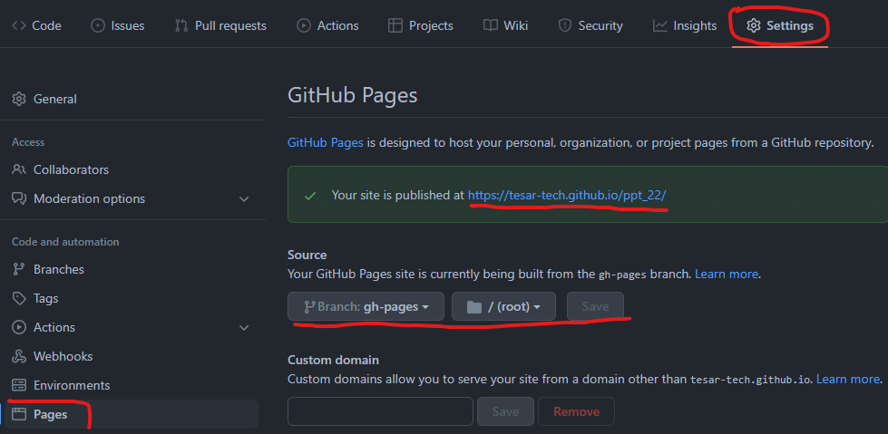
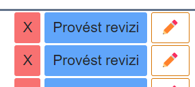

# 04 Github action, GH pages, Class Library projekt, Editace záznamu, nullable, EventCallback, Tailwind - defaultní styl

Co se bude dít s aplikací:

- Nasadíme webovou aplikaci "do internetu".
- Přidáme tlačítko editaci záznamu
- Umožníme záznam editovat (jeho název a datum)
- Unifikujeme tlačítka pod jednotný tailwind styl.

## GitHub actions

- Prostředí pro automatizaci (CI/CD)
- Ze začátku použijeme k sestavení (build) a nasazení aplikace (CD - continuous deployement).
  - V pozdějíšch cvičeních i k CI (continuous integration) - sestavení, testování, atd.
- Jednotlivé kroky a nastavení jsou definované v `.yml` souboru.
  - `yml`: využívá se ke konfiguraci. "`.json` bez závorek", umožňuje komentáře, kratší zápis, přehlednější, záleží na mezerách.  
- V repozitáři: Actions -> New workflow -> .NET (ale to je jedno, protože celý kód bude nahrazen:)
- Při každém pushnutí do větvě master se aplikace sestaví a publikuje a výsledek bude přidán do větvě gh-pages.
  - Což je zdrojový adresář webové aplikace
- Celý funkční soubor je níže. Jenom upravte řádky kam ukazují ☝️

```yml
# source: https://swimburger.net/blog/dotnet/how-to-deploy-aspnet-blazor-webassembly-to-github-pages
# source: https://dev.to/madhust/how-to-publish-blazor-webassembly-application-to-github-pages-using-github-action-54h4
name: Sestavit a nasadit apku # název - nezáleží na něm 

on:
  push:
    branches: [ master ] # když je push na větvi master
    # změnit na  ☝️  main (vaši hlavní větev)
env: #proměnné, které můžeme používat dále pomocí env.PUBLISH_DIR
  PUBLISH_DIR: vystup #výstupní složka kam se vybuildí aplikace (tuhle složku to vytvoří, na názvu nezáleží)
  
  
jobs:
  deploy-to-github-pages:
    runs-on: ubuntu-latest # use ubuntu-latest image to run steps on
    steps:
    # uses GitHub's checkout action to checkout code form the master branch
    - uses: actions/checkout@v3 # zpřístupní nám zdroják v repu
    - name: Nastavení .NET # stáhneme a nastavíme dotnet (není součástí základní instalace ubuntu)
      uses: actions/setup-dotnet@v1 #externí "action", její zdroják je https://github.com/actions/setup-dotnet
      with:
        dotnet-version: 6.0.x #verze
    - name: Publish with dotnet #do určené složky publikuje aplikace, v release configuraci
      run: dotnet publish 04/PptNemocnice/PptNemocnice.sln --configuration Release --output ${{env.PUBLISH_DIR}}
      # ☝️ Upravte 04/PptNemocnice/PptNemocnice.sln dle názvu vašeho .sln

    # změní tag base v index.html from '/' na 'ppt_22' což je gh page k tomuto repu
    - name: Change base-tag in index.html from / to ppt_22
      run: sed -i 's/<base href="\/" \/>/<base href="\/ppt_22\/" \/>/g' ${{env.PUBLISH_DIR}}/wwwroot/index.html
      # ☝️ Upravte ppt_22 dle názvu vašeho repozitáře
      
      # zkopíruje index.html do 404.html který je předložen, kdykoliv vstoupíme na stránku, která neexistuje
    - name: copy index.html to 404.html
      run: cp ${{env.PUBLISH_DIR}}/wwwroot/index.html ${{env.PUBLISH_DIR}}/wwwroot/404.html
      
    # přidá .nojekyll, čímž říká gh pages, že toto není jekkyl projekt (jinak to nedovolí soubor s podtržítkem)
    - name: Add .nojekyll file
      run: touch ${{env.PUBLISH_DIR}}/wwwroot/.nojekyll      
      
    # tato akce zařídí přenesení obsahu wwwroot složky to samostatné větve s názvem gh-pages
    # posléze je nutné nastavit v Settings -> Project větev gh-pages jako zdroj pro stránky
    - name: Commit wwwroot to GitHub Pages 
      uses: JamesIves/github-pages-deploy-action@v4.2.5
      with:
        GITHUB_TOKEN: ${{ secrets.GITHUB_TOKEN }} #token, který umožní manipulaci s repem (jako např. vytvoření větve gh-pages)
        BRANCH: gh-pages
        FOLDER: ${{env.PUBLISH_DIR}}/wwwroot #tady máme vypublikovanou celou aplikaci a ta bude v kořenovém adresáři ve větvi gh-pages
        #obsahuje například soubor index.html, který se použije k načtení celé stránky.
```

## GitHub Pages

- Umožňuje na určité adrese hostovat statické stránky z gh repozitáře.
- Stárnky už máme ve větvi gh-pages
- V nastavení repa říct gh z jaké větve chceme stránky hostovat:



- Po nasazení na gh-pages by se měla rozjet druhá action, která se postará o samotné zpracování a nasazení.


- Tadá, stránky běží

## PptNemocnice.Shared -> Přidání nového projektu

- PptNemocnice.Shared (typu C# class library (nemá to nic moc společného s Blazorem))
  - bude obsahovat věci, které budou sdílené s budoucím server projektem. 
- Sem přidejte třídu `VybaveniModel` (nezapomeňte změnit namespace a smazat ji z Blazor projektu)
- Přidejte referenci do Blazor projektu
  - Ve VS přetažením jednoho projektu na druhý nebo
  - úpravou `.csproj` souboru (PptNemocnice.csproj)
  
  ```xml
  <ItemGroup>
    <ProjectReference Include="..\PptNemocnice.Shared\PptNemocnice.Shared.csproj" />
  </ItemGroup>
  ```
- (odstraňte `Class1.cs` v případě, že existuje v Shared projektu (je to pouze templejtová třída, kterou nepotřebujeme))
- Nyní projekt funguje stejně jako předtím.

## Úprava vybavení (začátek)

- Přidejte tlačítko pro editaci záznamu.



- Toto tlačítko přehodí aktuální záznam do editačního módu.
  - Vytvořte v modelu vlastnost `IsInEditMode`
  - Po kliknutí na tlačítko se změní na true.
- V případě, že je záznam v edit módu, tak se místo výpisu textů (a datumů) zobrazí textová pole.
- Nyní je řádek ve stavu, kdy se po kliknutí na tlačítko změní vlastnost `IsInEditMode`. (ale nic se s tím neděje)
- Vytvořte editační vzhled v závislosti na `IsInEditMode` vlastnosti: `@if(!item.IsInEditMode)`
- Využijte `<input type="text" @bind-value=@item.Name/>`
  - `@bind-value` je dvoustranný (Two-way) binding, což zajistí propsání textu z textového pole do proměnné `item.Name`.
    - Jednostranným bindingem `Vale=item.Name` by se docílilo pouze vypsáním "staré" hodnoty `item.Name` do textového pole.
- Podobně vytvořte pole pro editaci datumů. UI pro editaci data (kalendář) je v závislosti na implementaci každého prohlížeče jiný. 
- `NeedsRevision` se přímo upravovat nedá, je dopočítán z datumů. 
- Odstraňte tlačítko pro smazání a revizi. Editovací tlačítko nahraďte textem "Ok".
- Poznámka: Kdybychom chtěli implementovat tlačítko "Zrušit změny" museli bychom si původní stav nejprve uložit (což budeme dodělávat posléze)


- Tímto značně naroste velikost kódu. I proto je vhodné si kód celého záznamu odložit do komponenty:

> **Zbytek tohoto soubor je jako domácí úloha**

## Tvorba komponent

- Ve složce Shared (ne projekt Shared) -> Add -> New Razor Component...
- Například s názvem `VybaveniRow`
- Veškerý obsah z foreache, kde vypisujete vybavení, přesuňte do komponenty. (vyskáče na vás pár chyb, které posléze opravíme).
- použijte komponentu:

```razor
@foreach (var item in seznamVybaveni)
{
    <VybaveniRow />
}
```

- Nyní musíme komponentě předat `item`.
- V komponentě vytvořte parametr. Je to veřejná vlastnost uvozená atributem `[Parameter]` typu stejného jako je `item` (`VybaveniModel`):

```csharp
[Parameter] public VybaveniModel Item { get;set; }
```

- Do parametru vložte proměnnou `item`:

```razor
    <VybaveniRow Item=item />
```

- Nyní upravíme kód v komponentě, tak aby vše fungovalo.
  - `item` změňte na `Item`
  - prozatím zakomentujte řádek z vymazáním záznamu (připomínám, ve VS zkratka Ctrl+K+C)

## Null reference Warning

- V C# 9/10 se daleko lépe pracuje s referenčními typy a jejich "nullabilitou".
- Klasicky referenční typu mohou být null, což často způsobuje problémy při běhu programu (klasicky Null reference exception).
- NullRefference warningy vás upozorní na to, že se to může stát. Běžně jsou to tyto zelené podtrženosti:


S textem: `Non-nullable property 'Item' must contain a non-null value when exiting constructor. Consider declaring the property as nullable`

- Takto zkonstruovaná properta je nastavená jako Non-nullable (nullable by byla s otazníkem `VybaveniModel? Item `).
  - Kód fungovat bude (je to jenom warning)
  - Ve starších C# verzích to problém "nebyl" (problém to byl, ale neukazovalo to warning)
  - Kontruktor žádný nemáme (takže tam ani nenastavujeme hodnotu `Item`)
- Řešením (špatným) je nastavit nějakou defaultní hodnotu, například:

```csharp
[Parameter] public VybaveniModel Item { get; set; } = new();
```

- Toto řešení ☝️ je ale špatný nápad. Zbytečně vytváříme novou instanci. Properta `Item` si čeká na to co ji přijde z foreache, nepotřebuje tam nic předtím.
- Další řešení je nastavit `Item` aby mohla přijmout null. Tedy udělat ji nullable, tak jak radí warning: `...Consider declaring the property as nullable`

```csharp
[Parameter] public VybaveniModel? Item { get; set; }
```

- Tento warning zmlknul, ale objevil se nový na místě, kde se snažíme použít `Item`.


- S hláškou `Dereference of a possibly null reference`. V případě, že by byla `Item` null, a my se snažili vyčíst nějakou hodnotu (`NeedsRevision` v tomto případě), kód pojde na Null reference Exception (což je věc, které se snažíme celou dobu vyvarovat).
- řešením je vůbec kód v takovém případě nespustit: 

```razor
@if (Item == null) return;//někde před použitím Item
```

- Celé to může působit jako zbytečná otrava, ale věřte mi, že trocha práce s nullabilitou v předstihu ušetří spoustu času (který byste jinak trávili odstraňováním NullReferenceException).

## EventCallBack -> Volání nadřazené komponenty

- Nyní k zakomentovanému řádku, který maže itemu ze seznamu.
- Problém je v tom že v komponentě `VybaveniRow` nemáme `seznamVybaveni`.
- Můžeme ho tam poslat v parametru. Avšak komponenta by se měla soustředit pouze na jeden řádek (podle toho se jmenuje) a navíc bychom stejně potřebovali aktualizovat celý seznam (z rodičovské komponenty, o tom později).
- Řešením je vytvořit EventCallback -> zavolat rodičovské komponentě a říct ji: "Tato itema chce být smazána, poraď si s tím".

```csharp
[Parameter] public EventCallback<VybaveniModel> DeleteItemCallback { get; set; }
```

A jeho použití:

```razor
<button @onclick="() => DeleteItemCallback.InvokeAsync()">
```

- Tímto se ale nic nesmaže. Jenom tím dáváme možnost rodičovské komponentě reagovat na takovéto volání. Položku smažeme takto:

```razor
<VybaveniRow Item=item DeleteItemCallback="() => seznamVybaveni.Remove(item)" />
```

## Tailwind - defaultní styl tlačítka

- Abychom nemuseli neustále opakovat ty samé vlastnosti pro každé tlačítko, přidáme základní - znovupoužitelný styl.
- Do index.html do tagu `<head>` přidejte:

```html
  <style type="text/tailwindcss">
        @layer components {
            .twbtn {
                @apply py-1.5 px-4 text-center text-white hover:opacity-80 hover:text-neutral-100 rounded-md focus:ring-2 focus:ring-opacity-75 focus:outline-none;
            }
        }
    </style>
```

- teď můžeme zkrátit zápis na:

```razor
<button @onclick="() => DeleteItemCallback.InvokeAsync()" class="twbtn bg-red-400">Smazat</button>

```


- Přidávat `<style>` do html stránky není úplně správně (všechno css by mělo být v .css souborech). Nicméně to vychází z potřeby použít tailwind cdn (které je určeno pouze pro testování). Díky cdn jsme si ušetřili pár kroků při nastavování a pohodlí z toho plynoucí za kousek "bad practice" v tomto případě stojí.

