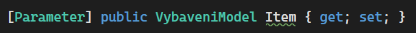

# 04 Github action, GH pages, Class Library projekt, KOMPONENTY A JEJICH KOMUNIKACE, nullable, EventCallback, Tailwind - defaultní styl, RenderFragment a ChildComponent, Validace formulářů

Co se bude dít s aplikací:

- Nasadíme webovou aplikaci "do internetu".
- Přidáme tlačítko editaci záznamu
- Umožníme záznam editovat (jeho název a datum)
- Přidáme tlačítko pro přidání nového záznamu
- Unifikujeme tlačítka pod jednotný tailwind styl.
- Přidáme tlačítka tam kde mají být
- Implementujeme zrušení editace (pamatuje si předchozí stav).
- Umožníme validovat jméno vybavení (nápříklad musí mít určitý počet znaků) a zobrazíme chybovou hlášku, když se tak nestane.

## GitHub actions

- Prostředí pro automatizaci (CI/CD)
- Ze začátku použijeme k sestavení (build) a nasazení aplikace (CD - continuous deployement).
  - V pozdějíšch cvičeních i k CI (continuous integration) - sestavení, testování, atd.
- Jednotlivé kroky a nastavení jsou definované v `.yml` souboru.
  - `yml`: využívá se ke konfiguraci. "`.json` bez závorek", umožňuje komentáře, kratší zápis, přehlednější, záleží na mezerách.  
- V repozitáři: Actions -> New workflow -> .NET (ale to je jedno, protože celý kód bude nahrazen:)
- Při každém pushnutí do větvě master se aplikace sestaví a publikuje a výsledek bude přidán do větvě gh-pages.
  - Což je zdrojový adresář webové aplikace

```yml
# source: https://swimburger.net/blog/dotnet/how-to-deploy-aspnet-blazor-webassembly-to-github-pages
# source: https://dev.to/madhust/how-to-publish-blazor-webassembly-application-to-github-pages-using-github-action-54h4
name: Sestavit a nasadit apku # název - nezáleží na něm 

on:
  push:
    branches: [ master ] # když je push na větvi master
env: #proměnné, které můžeme používat dále pomocí env.PUBLISH_DIR
  PUBLISH_DIR: vystup #výstupní složka kam se vybuildí aplikace (tuhle složku to vytvoří, na názvu nezáleží)
  
  
jobs:
  deploy-to-github-pages:
    runs-on: ubuntu-latest # use ubuntu-latest image to run steps on
    steps:
    # uses GitHub's checkout action to checkout code form the master branch
    - uses: actions/checkout@v3 # zpřístupní nám zdroják v repu
    - name: Nastavení .NET # stáhneme a nastavíme dotnet (není součástí základní instalace ubuntu)
      uses: actions/setup-dotnet@v1 #externí "action", její zdroják je https://github.com/actions/setup-dotnet
      with:
        dotnet-version: 6.0.x #verze
    - name: Publish with dotnet #do určené složky publikuje aplikace, v release configuraci
      run: dotnet publish 04_/PptNemocnice/PptNemocnice.sln --configuration Release --output ${{env.PUBLISH_DIR}}
      # ☝️ Upravte dle názvu vašeho .sln ☝️

    # změní tag base v index.html from '/' na 'ppt_22' což je gh page k tomuto repu
    - name: Change base-tag in index.html from / to ppt_22
      run: sed -i 's/<base href="\/" \/>/<base href="\/ppt_22\/" \/>/g' ${{env.PUBLISH_DIR}}/wwwroot/index.html
      # ☝️ Upravte dle názvu vašeho repozitáře ☝️
      
      # zkopíruje index.html do 404.html který je předložen, kdykoliv vstoupíme na stránku, která neexistuje
    - name: copy index.html to 404.html
      run: cp ${{env.PUBLISH_DIR}}/wwwroot/index.html ${{env.PUBLISH_DIR}}/wwwroot/404.html
      
    # přidá .nojekyll, čímž říká gh pages, že toto není jekkyl projekt (jinak to nedovolí soubor s podtržítkem)
    - name: Add .nojekyll file
      run: touch ${{env.PUBLISH_DIR}}/wwwroot/.nojekyll      
      
    # tato akce zařídí přenesení obsahu wwwroot složky to samostatné větve s názvem gh-pages
    # posléze je nutné nastavit v Settings -> Project větev gh-pages jako zdroj pro stránky
    - name: Commit wwwroot to GitHub Pages 
      uses: JamesIves/github-pages-deploy-action@v4.2.5
      with:
        GITHUB_TOKEN: ${{ secrets.GITHUB_TOKEN }} #token, který umožní manipulaci s repem (jako např. vytvoření větve gh-pages)
        BRANCH: gh-pages
        FOLDER: ${{env.PUBLISH_DIR}}/wwwroot #tady máme vypublikovanou celou aplikaci a ta bude v kořenovém adresáři ve větvi gh-pages
        #obsahuje například soubor index.html, který se použije k načtení celé stránky.
```

## GitHub Pages

- Umožňuje na určité adrese hostovat statické stránky z gh repozitáře.
- Stárnky už máme ve větvi gh-pages
- V nastavení repa říct gh z jaké větve chceme stránky hostovat:


- Po nasazení na gh-pages by se měla rozjet druhá action, která se postará o samotné zpracování a nasazení.


- Tadá, stránky běží

## PptNemocnice.Shared -> Přidání nového projektu

- PptNemocnice.Shared (typu C# class library (nemá to nic moc společného s Blazorem))
  - bude obsahovat věci, které budou sdílené s budoucím server projektem. 
- Sem přidejte třídu `VybaveniModel` (nezapomeňte změnit namespace a smazat ji z Blazor projektu)
- Přidejte referenci do Blazor projektu
  - Ve VS přetažením jednoho projektu na druhý nebo
  - úpravou `.csproj` souboru (PptNemocnice.csproj)
  
  ```xml
  <ItemGroup>
    <ProjectReference Include="..\PptNemocnice.Shared\PptNemocnice.Shared.csproj" />
  </ItemGroup>
  ```
- (odstraňte `Class1.cs` v případě, že existuje v Shared projektu (je to pouze templejtová třída, kterou nepotřebujeme))
- Nyní projekt funguje stejně jako předtím.

## Úprava vybavení (začátek)

- Přidejte tlačítko pro editaci záznamu.


- Toto tlačítko přehodí aktuální záznam do editačního módu.
  - Vytvořte v modelu vlastnost `IsInEditMode`
  - Po kliknutí na tlačítko se změní na true.
- V případě, že je záznam v edit módu, tak se místo výpisu textů (a datumů) zobrazí textová pole.

```razor
 <td><input type="date" @bind-value=item.BoughtDateTime/> </td>
```

- Tímto značně naroste velikost kódu. I proto je vhodné si kód celého záznamu odložit do komponenty (viz níže).
- Ve finále vznikne něco takového:


## Tvorba komponent

- Ve složce Shared (ne projekt Shared) -> Add -> New Razor Component...
- Například s názvem `VybaveniRow`
- Veškerý obsah z foreache, kde vypisujete vybavení, přesuňte do komponenty. (vyskáče na vás pár chyb, které posléze opravíme).
- použijte komponentu:

```razor
@foreach (var item in seznamVybaveni)
{
    <VybaveniRow />
}
```

- Nyní musíme komponentě předat `item`. 
- V komponentě vytvořte parametr. Je to veřejná vlastnost uvozená atributem `[Parameter]` typu stejného jako je `item` (`VybaveniModel`).
- Do parametru vložte proměnnou `item`:

```razor
    <VybaveniRow Item=item />
```

- Nyní upravíme kód v komponentě, tak aby vše fungovalo.
  - `item` změňte na `Item`
  - prozatím zakomentujte řádek z vymazáním záznamu (připomínám, ve VS zkratka Ctrl+K+C)

## Null reference Warning

- V C# 9/10 se daleko lépe pracuje s referenčními typy a jejich "nullabilitou".
- Klasicky referenční typu mohou být null, což často způsobuje problémy při běhu programu (klasicky Null reference exception).
- NullRefference warningy vás upozorní na to, že se to může stát. Běžně jsou to tyto zelené podtrženosti:



S textem: `Non-nullable property 'Item' must contain a non-null value when exiting constructor. Consider declaring the property as nullable`

- Takto zkonstruovaná properta je nastavená jako Non-nullable (nullable by byla s otazníkem `VybaveniModel? Item `).
  - Kód fungovat bude (je to jenom warning)
  - Ve starších C# verzích to problém "nebyl" (problém to byl, ale neukazovalo to warning)
  - Kontruktor žádný nemáme (takže tam ani nenastavujeme hodnotu `Item`)
- Řešením (špatným) je nastavit nějakou defaultní hodnotu, například:

```csharp
[Parameter] public VybaveniModel Item { get; set; } = new();
```

- Toto řešení ☝️ je ale špatný nápad. Zbytečně vytváříme novou instanci. Properta `Item` si čeká na to co ji přijde z foreache, nepotřebuje tam nic předtím.
- Další řešení je nastavit `Item` aby mohla přijmout null. Tedy udělat ji nullable, tak jak radí warning: `...Consider declaring the property as nullable`

```csharp
[Parameter] public VybaveniModel? Item { get; set; }
```

- Tento warning zmlknul, ale objevil se nový na místě, kde se snažíme použít `Item`.


- S hláškou `Dereference of a possibly null reference`. V případě, že by byla `Item` null, a my se snažili vyčíst nějakou hodnotu (`NeedsRevision` v tomto případě), kód pojde na Null reference Exception (což je věc, které se snažíme celou dobu vyvarovat).
- řešením je vůbec kód v takovém případě nespustit: 

```razor
@if (Item == null) return;//někde před použitím Item
```

- Celé to může působit jako zbytečná otrava, ale věřte mi, že trocha práce s nullabilitou v předstihu ušetří spoustu času (který byste jinak trávili odstraňováním NullReferenceException).

## EventCallBack -> Volání nadřazené komponenty

- Nyní k zakomentovanému řádku, který maže itemu ze seznamu.
- Problém je v tom že v komponentě `VybaveniRow` nemáme `seznamVybaveni`.
- Můžeme ho tam poslat v parametru. Avšak komponenta by se měla soustředit pouze na jeden řádek (podle toho se jmenuje) a navíc bychom stejně potřebovali aktualizovat celý seznam (z rodičovské komponenty, o tom později).
- Řešením je vytvořit EventCallback -> zavolat rodičovské komponentě a říct ji: "Tato itema chce být smazána, poraď si s tím".

```csharp
[Parameter] public EventCallback<VybaveniModel> DeleteItemCallback { get; set; }
```

A jeho použití:

```razor
<button @onclick="() => DeleteItemCallback.InvokeAsync()">
```

- Tímto se ale nic nesmaže. Jenom tím dáváme možnost rodičovské komponentě reagovat na takovéto volání. Položku smažeme takto:

```razor
<VybaveniRow Item=item DeleteItemCallback="() => seznamVybaveni.Remove(item)" />
```

## Editace záznamu

- Nyní je řádek ve stavu, kdy se po kliknutí na tlačítko změní vlastnost `IsInEditMode`. (ale nic se s tím neděje)
- Vytvořte editační vzhled v závislosti na `IsInEditMode` vlastnosti: `@if(!Item.IsInEditMode)`
- Využijte `<input type="text" @bind-value=@Item.Name/>`
  - `@bind-value` je dvoustranný (Two-way) binding, což zajistí propsání textu z textového pole do proměnné `Item.Name`.
    - Jednostranným bindingem `Vale=Item.Name` by se docílilo pouze vypsáním "staré" hodnoty `Item.Name` do textového pole.
- Podobně vytvořte pole pro editaci datumů. UI pro editaci data (kalendář) je v závislosti na implementaci každého prohlížeče jiný. 
- `NeedsRevision` se přímo upravovat nedá, je dopočítán z datumů. 
- Odstraňte tlačítko pro smazání a revizi. Editovací tlačítko nahraďte textem "Ok".
- Poznámka: Kdybychom chtěli implementovat tlačítko "Zrušit změny" museli bychom si původní stav nejprve uložit (což budeme dodělávat posléze)


## Tailwind - defaultní styl tlačítka

- Abychom nemuseli neustále opakovat ty samé vlastnosti pro každé tlačítko, přidáme základní - znovupoužitelný styl.
- Do index.html do tagu `<head>` přidejte:

```html
  <style type="text/tailwindcss">
        @layer components {
            .twbtn {
                @apply py-1.5 px-4 text-center text-white hover:opacity-80 hover:text-neutral-100 rounded-md focus:ring-2 focus:ring-opacity-75 focus:outline-none;
            }
        }
    </style>
```

- Přidávat `<style>` do html stránky není úplně správně (všechno css by mělo být v .css souborech). Nicméně to vychází z potřeby použít tailwind cdn (které je určeno pouze pro testování). Díky cdn jsme si ušetřili pár kroků při nastavování a pohodlí z toho plynoucí za kousek "bad practice" v tomto případě stojí. 

## Nový záznam


- Přidejte tlačítko pro přidání nového záznamu.
- Vytvořte proměnnou `isInNewMode` (ve `Vybaveni.razor`). Tlačítkem změníte hodnotu.
- V případě, že je hodnota `isInNewMode` false, tak je zobrazeno tlačítko
- V případě, že je hodnota true, tak se přidá nový řádek do tabulky a v tom otevřený záznam.
  - Tento řádek bude ve skutečnosti použití komponenty `VybaveniRow`. Toto je druhý dobrý důvod proč komponentu používat (první byl, že se kód neplete na jednom místě => je přehlednější). Pro stejnou (podobnou) věc (editace záznamu v tomto případě) není nutné psát kód znovu, ale stačí využít existující komponentu.
  - Na začátek nastavte tomuto záznamu dnešní datum.
  - Dále přidejte 2 tlačítka - jedno pro přidání a druhé pro zrušení.
- Záznam přidejte na začátek seznamu

## RenderFragment a ChildContent -> Jak z vnějšku ovlivnit komponentu

- Znovu využití komponenty s sebou nese i pár nástrah. Při přidávání záznamu například není vhodné, aby bylo k dispozici tlačítko "✏️/Ok". Také by nebylo od věci, kdyby tlačítka "Přidej" a "Zruš" byla právě místo "✏️/Ok" (nyní jsou pod řádkem).
- Pomocí property typu `RenderFragment` je možné vyrendrovat určitou část komponenty, která se mění z vnějšku. 

```csharp
[Parameter] public RenderFragment? ChildContent { get; set; }
```

- Vlastnost typu `RenderFragment` se v tomto případě jmenuje `ChildContent`. Je možné je využít následujícím způsobem:

```razor 
<VybaveniRow Item=newModel>
    <button @onclick="() => {seznamVybaveni.Insert(0,newModel); newModel.IsInEditMode = false; isInNewMode = false;}" class="twbtn bg-teal-500">Přidej</button>
    <button @onclick="() => isInNewMode = false" class="twbtn bg-yellow-500">Zrušit</button>
</VybaveniRow>
```

- ChildContent jsou v tomto případě tlačítka. Kam se v komponentě `VybaveniRow` vyrenderují záleží na umístění `@ChildContent`.

```razor
 @if (ChildContent == null)
 {
     <button @onclick="() => Item.IsInEditMode = false" class="border-[1px] border-amber-600 rounded-sm text-sm px-2 py-1">Ok</button>
 }
 else
 {
     @ChildContent
 }
```

- Pokud je `ChildContent` null (nic mu nebylo nastaveno), tak se přidá tlačítko "Ok". V případě, že nějaký `ChildContent` existuje, tak se vypíše ten.


- (Poznámka) Název ChildContent není povinný. V případě potřeby je možné mít vícero RederFragment vlastností (a všechny se nemohou jmenovat ChildContent). Nicméně s názvem ChildContent je možné psát HTML rovnou to tagu komponenty. V případě:

```csharp
[Parameter] public RenderFragment? NecoUvnitr { get; set; }
```

je nutné uvést otevírací i zavírací tag fragmentu:

```razor 
<VybaveniRow Item=newModel>
  <NecoUvnitr>
    <button @onclick="() => {seznamVybaveni.Insert(0,newModel); newModel.IsInEditMode = false; isInNewMode = false;}" class="twbtn bg-teal-500">Přidej</button>
    <button @onclick="() => isInNewMode = false" class="twbtn bg-yellow-500">Zrušit</button>
  </NecoUvnitr>
</VybaveniRow>
```

## Validace formulářů + možnost zrušení editace 


- Omezení vstupních dat pouze na validní hodnoty.
- Aktuální stav aplikace umožňuje vstup jakékoli hodnoty (i prázdné).
- Validace má několik úrovní
- Aplikace musí být schopna vrátit stav do needitované (validní) formy
  - Nyní se změny dějí přímo na objektu (což je problém)
  - Vyžaduje výraznější úpravu

### HTML Formuláře

- Element `<form>`. Umožňuje pracovat se vstupními hodnotami (element `<input>`).
- Při stisknutí tlačítka, které je uvnitř formuláře se formulář "Odešle" (Submit)
  - Na to musí být navázána nějaká akce/url
- V Blazoru obhospodařeno pomocí komponenty `EditForm`

### EditForm

- Vyrenderuje se jako `form`.
- Umožňuje kontrolovat validaci vstupů (vnořená komponenta `<DataAnnotationsValidator/>`)
  - Spolupracuje s Modelem (VybaveniModel) a [Atributy](https://docs.microsoft.com/en-us/dotnet/csharp/programming-guide/concepts/attributes/).

- Editační komponenty musíme umístit do `EditForm`
- Jelikož jsou jednotlivé inputy v buňce tabulky (`td`) nemůže formulář umístit v tabulce, ani v `tr` tagu
  - (je to trochu nešťastné, ale ne neřešitelné)
- Formulář umístíme do jedné buňky, které nastavíme `colspan` (přes kolik buněk se rozšíří, defaultně 1) na 5 (celou tabulku, všechny sloupce)
- Uvnitř této buňky vytvoříme novou tabulku s jedním řádkem

```razor
<tr class="border-2 border-slate-400">
    <td colspan="5">
        <EditForm Model=editingItem OnValidSubmit="() => TurnOffEdit(true)">
            <DataAnnotationsValidator />
            <ValidationSummary />
            <table>
                <tr>
                    <td><InputText class="border-2 border-slate-300" @bind-Value=@editingItem.Name /></td>
```

- `Model=editingItem` - vlastnost `Model` nastavuje proměnnou, kterou má formulář validovat. Je stejného typu jako Item (`VybaveniModel`).
  - Důvodem, proč tam není `Item` je právě možnost zrušení editace (hodnoty se pak kopírují z `Item` do `editItem` a obráceně). Vyřešíme dál.
- `OnValidSubmit` nastavuje co se stane, když formulář bude "odeslán" (stisknuto tlačítko) a data nastavená v `Model` budou validní (alespoň 5 znaků na jménu). Toto nám ušetří dost práce oproti "ruční" validaci.
  - Míří to na metodu `TurnOfEdit`, (vytvořte ji nyní, implementaci doděláme).
- Místo `<input>` jsme použili komponentu `InputText`, právě z důvodu spolupráce s `EditForm` a `DataAnnotationsValidator`. `InputText` je zodpovědný za vlastní validaci (vyhmátne ji z atributů) a zobrazení jejího výsledku ve formě css třídy).
  - @bind-Value má velké "V". `Value` je název vlastnosti uvnitř `InputText` komponenty.
  - vyrenderuje se jako `<input>`
- Stejnou změnu udělejte i u ostatních vstupů

### DataAnnotation - Atributy určené k anotaci dat

- Například chceme zmínit, že dané pole `Name` je povinné.
- Také musí mít délku alespoň 5 znaků.
- Chybovou hlášku můžeme libovolně změnit:

```csharp
[Required,MinLength(5,ErrorMessage = "Délka u pole \"{0}\" musí být alespoň {1} znaků")]
[Display(Name = "Název")]
public string Name { get; set; } = "";
```

### Úpravy na editItem

- Úpravy se budou provádět na proměnné `editItem`
- Potřebujeme mechanismus jak zjistit, že se `Item` má upravovat

```csharp
VybaveniModel? _Item;
[Parameter]
public VybaveniModel? Item
{
    get => _Item;
    set
    {
        _Item = value;
        if (value != null && value.IsInEditMode)
            TurnOnEdit();
    }
}
```

- pokaždé, když se nastavuje `Item` a je otevřena v editačním módu, tak zavoláme metodu `TurOnEdit`
- Tu také voláme na tlačítku Edit:

```razor
<button @onclick="() => TurnOnEdit()" class="border-[1px] border-amber-600 rounded-sm text-sm px-2 py-1">✏️</button>
```

- Její implementace:

```csharp
private void TurnOnEdit()
{
    if (Item != null)
    {
        Item.IsInEditMode = true;
        editingItem = Item.Copy();
    }
}
```

- Zapne se `IsInEditMode` (v případě že není, což je při kliknutí na tlačítko) a do `editingItem` se zkopírují hodnoty vlastností:

```csharp
//VybaveniModel třída
  public  VybaveniModel Copy()
    {
        VybaveniModel to = new();
        to.BoughtDateTime = BoughtDateTime;
        to.LastRevision = LastRevision;
        to.IsInEditMode = IsInEditMode;
        to.Name = Name;
        return to;
    }
```

- Vlastnosti nelze zkopírovat `editingItem = Item`. To by obě proměnné referencovali stejný objekt. My chceme vytvořit nový objekt. 

- Změníme podmínky, jestli ukazovat `Item` nebo `editItem`

```razor
@if (Item != null && !Item.IsInEditMode)
{...}
else if (editingItem != null && editingItem.IsInEditMode)
{...}
```

- Vypnutí editačního módu: 

```csharp
private void TurnOffEdit(bool success)
{
    if (success)
    {
        editingItem?.MapTo(Item);
    }
    if (Item is not null)
        Item.IsInEditMode = false;
    editingItem = null;
    EditDoneCallback.InvokeAsync(success);
}
```

- `success` nám řekne, jestli byla akce potvrzená (Ok, true) nebo zrušená (Zrušit, false). V případě true, se namapují hodnoty vlastností zpět na `Item`:

```csharp
//VybaveniModel třída
public void MapTo(VybaveniModel? to)
{
    if (to == null) return;
    to.BoughtDateTime = BoughtDateTime;
    to.LastRevision = LastRevision;
    to.Name = Name;
}
```

- V metodě `TurnOffEdit` se aktivuje `EditDoneCallback`, pomocí něhož řekneme rodičovské komponentě, jestli se něco změnilo nebo ne. Toho využijeme především pro přidání nového řádku (`Vybaveni.razor`):

```razor
<VybaveniRow EditDoneCallback="(success) => { if(success)seznamVybaveni.Insert(0,newModel); isInNewMode = false; }" Item=newModel>
    <button  class="twbtn bg-teal-500">Přidej</button>
    <button type="button" @onclick="() => isInNewMode = false" class="twbtn bg-yellow-500">Zrušit</button>
</VybaveniRow>
```

- Taky byla odebrána akce na tlačítku "Přidej". Automaticky se bude snažit submitnout formulář, tento pokus se odchytí v `OnValidSubmit` (nebo se ukáže hláška validace)
- Na tlačítku zrušit jsme přidali vlastnost `type="button"`. Defaultně mají tlačítka `type="submit"`, takže by se rušící tlačítko odesílalo formulář. 


