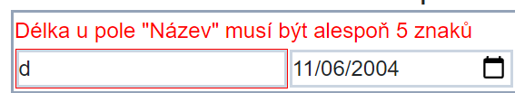

# 05 Nový záznam, komponenty a jejich komunikace RenderFragment a ChildComponent, Validace formulářů

Co se bude dít s aplikací:

- Přidáme tlačítko pro přidání nového záznamu
- Přidáme tlačítka tam kde mají být
- Implementujeme zrušení editace (pamatuje si předchozí stav).
- Umožníme validovat jméno vybavení (nápříklad musí mít určitý počet znaků) a zobrazíme chybovou hlášku, když se tak nestane.

## Nový záznam


- Přidejte tlačítko pro přidání nového záznamu.
- Vytvořte proměnnou `isInNewMode` (ve `Vybaveni.razor`). Tlačítkem změníte hodnotu.
- V případě, že je hodnota `isInNewMode` false, tak je zobrazeno tlačítko
- V případě, že je hodnota true, tak se přidá nový řádek do tabulky a v tom otevřený záznam.
  - Tento řádek bude ve skutečnosti použití komponenty `VybaveniRow`. Toto je druhý dobrý důvod proč komponentu používat (první byl, že se kód neplete na jednom místě => je přehlednější). Pro stejnou (podobnou) věc (editace záznamu v tomto případě) není nutné psát kód znovu, ale stačí využít existující komponentu.
  - Na začátek nastavte tomuto záznamu dnešní datum.
  - Dále přidejte 2 tlačítka - jedno pro přidání a druhé pro zrušení.
- Záznam přidejte na začátek seznamu

## RenderFragment a ChildContent -> Jak z vnějšku ovlivnit komponentu

- Znovu využití komponenty s sebou nese i pár nástrah. Při přidávání záznamu například není vhodné, aby bylo k dispozici tlačítko "✏️/Ok". Také by nebylo od věci, kdyby tlačítka "Přidej" a "Zruš" byla právě místo "✏️/Ok" (nyní jsou pod řádkem).
- Pomocí property typu `RenderFragment` je možné vyrendrovat určitou část komponenty, která se mění z vnějšku. 

```csharp
[Parameter] public RenderFragment? ChildContent { get; set; }
```

- Vlastnost typu `RenderFragment` se v tomto případě jmenuje `ChildContent`. Je možné je využít následujícím způsobem:

```razor 
<VybaveniRow Item=newModel>
    <button @onclick="() => {seznamVybaveni.Insert(0,newModel); newModel.IsInEditMode = false; isInNewMode = false;}" class="twbtn bg-teal-500">Přidej</button>
    <button @onclick="() => isInNewMode = false" class="twbtn bg-yellow-500">Zrušit</button>
</VybaveniRow>
```

- ChildContent jsou v tomto případě tlačítka. Kam se v komponentě `VybaveniRow` vyrenderují záleží na umístění `@ChildContent`.

```razor
 @if (ChildContent == null)
 {
     <button @onclick="() => Item.IsInEditMode = false" class="border-[1px] border-amber-600 rounded-sm text-sm px-2 py-1">Ok</button>
 }
 else
 {
     @ChildContent
 }
```

- Pokud je `ChildContent` null (nic mu nebylo nastaveno), tak se přidá tlačítko "Ok". V případě, že nějaký `ChildContent` existuje, tak se vypíše ten.


- (Poznámka) Název ChildContent není povinný. V případě potřeby je možné mít vícero RederFragment vlastností (a všechny se nemohou jmenovat ChildContent). Nicméně s názvem ChildContent je možné psát HTML rovnou to tagu komponenty. V případě:

```csharp
[Parameter] public RenderFragment? NecoUvnitr { get; set; }
```

je nutné uvést otevírací i zavírací tag fragmentu:

```razor 
<VybaveniRow Item=newModel>
  <NecoUvnitr>
    <button @onclick="() => {seznamVybaveni.Insert(0,newModel); newModel.IsInEditMode = false; isInNewMode = false;}" class="twbtn bg-teal-500">Přidej</button>
    <button @onclick="() => isInNewMode = false" class="twbtn bg-yellow-500">Zrušit</button>
  </NecoUvnitr>
</VybaveniRow>
```

## Validace formulářů + možnost zrušení editace 



- Omezení vstupních dat pouze na validní hodnoty.
- Aktuální stav aplikace umožňuje vstup jakékoli hodnoty (i prázdné).
- Validace má několik úrovní
- Aplikace musí být schopna vrátit stav do needitované (validní) formy
  - Nyní se změny dějí přímo na objektu (což je problém)
  - Vyžaduje výraznější úpravu

### HTML Formuláře

- Element `<form>`. Umožňuje pracovat se vstupními hodnotami (element `<input>`).
- Při stisknutí tlačítka, které je uvnitř formuláře se formulář "Odešle" (Submit)
  - Na to musí být navázána nějaká akce/url
- V Blazoru obhospodařeno pomocí komponenty `EditForm`

### EditForm

- Vyrenderuje se jako `form`.
- Umožňuje kontrolovat validaci vstupů (vnořená komponenta `<DataAnnotationsValidator/>`)
  - Spolupracuje s Modelem (VybaveniModel) a [Atributy](https://docs.microsoft.com/en-us/dotnet/csharp/programming-guide/concepts/attributes/).

- Editační komponenty musíme umístit do `EditForm`
- Jelikož jsou jednotlivé inputy v buňce tabulky (`td`) nemůže formulář umístit v tabulce, ani v `tr` tagu
  - (je to trochu nešťastné, ale ne neřešitelné)
- Formulář umístíme do jedné buňky, které nastavíme `colspan` (přes kolik buněk se rozšíří, defaultně 1) na 5 (celou tabulku, všechny sloupce)
- Uvnitř této buňky vytvoříme novou tabulku s jedním řádkem

```razor
<tr class="border-2 border-slate-400">
    <td colspan="5">
        <EditForm Model=editingItem OnValidSubmit="() => TurnOffEdit(true)">
            <DataAnnotationsValidator />
            <ValidationSummary />
            <table>
                <tr>
                    <td><InputText class="border-2 border-slate-300" @bind-Value=@editingItem.Name /></td>
```

- `Model=editingItem` - vlastnost `Model` nastavuje proměnnou, kterou má formulář validovat. Je stejného typu jako Item (`VybaveniModel`).
  - Důvodem, proč tam není `Item` je právě možnost zrušení editace (hodnoty se pak kopírují z `Item` do `editItem` a obráceně). Vyřešíme dál.
- `OnValidSubmit` nastavuje co se stane, když formulář bude "odeslán" (stisknuto tlačítko) a data nastavená v `Model` budou validní (alespoň 5 znaků na jménu). Toto nám ušetří dost práce oproti "ruční" validaci.
  - Míří to na metodu `TurnOfEdit`, (vytvořte ji nyní, implementaci doděláme).
- Místo `<input>` jsme použili komponentu `InputText`, právě z důvodu spolupráce s `EditForm` a `DataAnnotationsValidator`. `InputText` je zodpovědný za vlastní validaci (vyhmátne ji z atributů) a zobrazení jejího výsledku ve formě css třídy).
  - @bind-Value má velké "V". `Value` je název vlastnosti uvnitř `InputText` komponenty.
  - vyrenderuje se jako `<input>`
- Stejnou změnu udělejte i u ostatních vstupů

### DataAnnotation - Atributy určené k anotaci dat

- Například chceme zmínit, že dané pole `Name` je povinné.
- Také musí mít délku alespoň 5 znaků.
- Chybovou hlášku můžeme libovolně změnit:

```csharp
[Required,MinLength(5,ErrorMessage = "Délka u pole \"{0}\" musí být alespoň {1} znaků")]
[Display(Name = "Název")]
public string Name { get; set; } = "";
```

## Domácí úloha

## Validace dat

- Přidejte modelu vlastnost "Cena" (pro zjednodušení to bude `int`). Zobrazte cenu v tabulce.
- Přidejte validaci. Cena nesmí být záporná a její maximum je 10 000 000.
  - Přidejte správné validační zprávy
  - Využijte komponentu `<ValidationMessage` a zobrazte validační zprávy vždy u daného pole (tedy pro jméno a cenu).

### Úpravy na editItem

- Úpravy se budou provádět na proměnné `editItem`
- Potřebujeme mechanismus jak zjistit, že se `Item` má upravovat

```csharp
VybaveniModel? _Item;
[Parameter]
public VybaveniModel? Item
{
    get => _Item;
    set
    {
        _Item = value;
        if (value != null && value.IsInEditMode)
            TurnOnEdit();
    }
}
```

- pokaždé, když se nastavuje `Item` a je otevřena v editačním módu, tak zavoláme metodu `TurOnEdit`
- Tu také voláme na tlačítku Edit:

```razor
<button @onclick="() => TurnOnEdit()" class="border-[1px] border-amber-600 rounded-sm text-sm px-2 py-1">✏️</button>
```

- Její implementace:

```csharp
private void TurnOnEdit()
{
    if (Item != null)
    {
        Item.IsInEditMode = true;
        editingItem = Item.Copy();
    }
}
```

- Zapne se `IsInEditMode` (v případě že není, což je při kliknutí na tlačítko) a do `editingItem` se zkopírují hodnoty vlastností:

```csharp
//VybaveniModel třída
  public  VybaveniModel Copy()
    {
        VybaveniModel to = new();
        to.BoughtDateTime = BoughtDateTime;
        to.LastRevision = LastRevision;
        to.IsInEditMode = IsInEditMode;
        to.Name = Name;
        return to;
    }
```

- Vlastnosti nelze zkopírovat s pomocí `editingItem = Item`. To by obě proměnné referencovali stejný objekt (takže by se při změně `editItem.Name` změnilo i `Item.Name`). My chceme vytvořit nový objekt.

- Změníme podmínky, jestli ukazovat `Item` nebo `editItem` (v závislosti na tom, jestli se proměnná naćhází v editačním modu)

```razor
@if (Item != null && !Item.IsInEditMode)
{...}
else if (editingItem != null && editingItem.IsInEditMode)
{...}
```

- Vypnutí editačního módu (volám při kliknutí na tlačítko Ok nebo při `OnValidSubmit`): 

```csharp
private void TurnOffEdit(bool success)
{
    if (success)
    {
        editingItem?.MapTo(Item);
    }
    if (Item is not null)
        Item.IsInEditMode = false;
    editingItem = null;
    EditDoneCallback.InvokeAsync(success);
}
```

- `success` nám řekne, jestli byla akce potvrzená (Ok, true) nebo zrušená (Zrušit, false). V případě true, se namapují hodnoty vlastností zpět na `Item`:

```csharp
//VybaveniModel třída
public void MapTo(VybaveniModel? to)
{
    if (to == null) return;
    to.BoughtDateTime = BoughtDateTime;
    to.LastRevision = LastRevision;
    to.Name = Name;
}
```

- V metodě `TurnOffEdit` se aktivuje `EditDoneCallback`, pomocí něhož řekneme rodičovské komponentě, jestli se něco změnilo nebo ne. Toho využijeme především pro přidání nového řádku (`Vybaveni.razor`):

```razor
<VybaveniRow EditDoneCallback="(success) => { if(success)seznamVybaveni.Insert(0,newModel); isInNewMode = false; }" Item=newModel>
    <button  class="twbtn bg-teal-500">Přidej</button>
    <button type="button" @onclick="() => isInNewMode = false" class="twbtn bg-yellow-500">Zrušit</button>
</VybaveniRow>
```

- Taky byla odebrána akce na tlačítku "Přidej". Automaticky se bude snažit submitnout formulář, tento pokus se odchytí v `OnValidSubmit` (nebo se ukáže hláška validace)
- Na tlačítku zrušit jsme přidali vlastnost `type="button"`. Defaultně mají tlačítka `type="submit"`, takže by se rušící tlačítko odesílalo formulář. 

