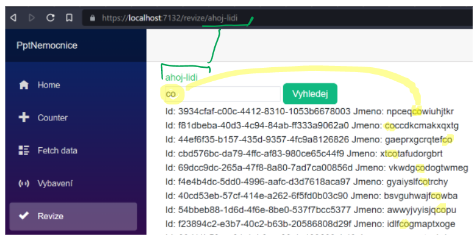

# 09 - test 01

Výsledek může vypadat například takto:

- [1] Vytvořte stránku s názvem `RevizePage` (ve správné složce) a přidejte stránku jako odkaz do levého sloupce (s nějaký defaultním parametrem)
- [1] Stránka bude dostupná například na adrese `revize/ahoj-lidi`
  - `ahoj-lidi` je příklad zadaného parametru, klidně to může být například `revize/nazdar`
- [1] Tento parametr se zobrazí na stránce v nadpisu první úrovně **zelenou barvou**.
  - Že je parametr typu string není třeba v routě specifikovat (když se o to budete snažit, vyrazí to chybu)

- [1] Stránka bude obsahovat textové pole, tlačítko a místo pro výpis výsledku.
- V místě pro výpis výsledků se po zadání textového řetězce do textového pole objeví ty revize, které obsahují daný textový řetězec (zjednodušené vyhledávání)
- Po stisknutí se odešle požadavek na server (api projekt), kde již bude přichystána "databáze" revizí pro filtraci (vizte další kroky).
- [1] Vytvořte (ve správném projektu) třídu `RevizeModel` a přiřaďte jí vlastnosti: Název a Id (případně ekvivalentní anglické názvy) (časem to propojíme s Vybavením, ale to není předmětem testu).
- [1] V api projektu musíte vytvořit seznam revizí a naplnit je náhodnými daty. Data budou udržována v privátní proměnné (tak jak to bylo s vybavením).
- V api projektu musíte vytvořit vhodný endpoint a v Blazor projektu ho vhodně využít.
  - [1] Blazor projekt odešle správný požadavek (po stisknutí tlačítka) a zpracuje úspěšný výsledek (nemusíte ošetřovat neúspěšné výsledky). Výsledkem toho kroku bude proměnná obsahující revize.
  - [1] Endpoint přijme string a vrátí list revizí (musíte zvolit vhodnou http metodu)
    - [1] Vrátí ty revize, jenž obsahují textový řetězec
  - [1] Blazor projekt vhodně vypíše vyhledané výsledky

