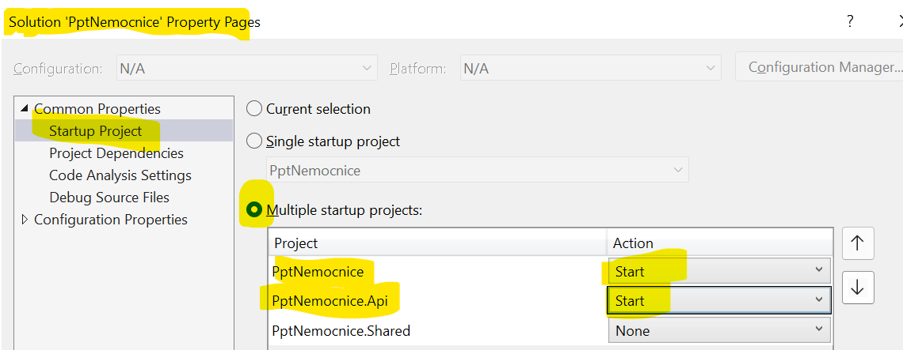
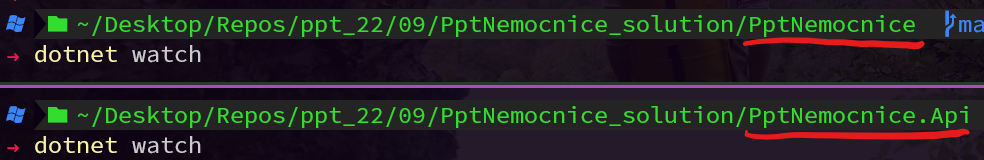
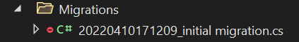
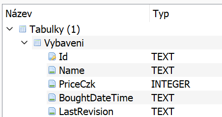

# 10 Spojení projektů, Loader komponenta, Databáze, SQLite, EntityFramework, AutoMapper, Migrace

## Spojení projektu do jedné solution

- Na klientský i api projekt máme nyní zvlášť 2 solution.
  - Je tedy nutné mít otevřené 2 instance VS
  - Mělo to smysl pro demonstraci toho, že aplikace jsou na sobě nezávislé a komunikují pouze skrze REST api.
  - Pro vývoj to však není uplně vhodné.
- Smažte .sln api projektu
- Do .sln `Pptnemocnice` přidat api projekt
- Projekty jsou stále oddělené. Stále musíte spustit oba aby fungovala jak serverová, tak klientská část.
- Projekty ve stejné .sln umožňují lepší práci (nemáme otevřené VS 2x)
- Pro spuštění 2 projektů ve vs: Properties na .sln:

  

- A nebo pomocí `dotnet watch` z terminálu: 
  

## Loader komponenta

- Ze cv07 vytvořte Loader komponentu, kterou použijime všude tam, kde se bude něco načítat.
- Díky použití komponenty nemusíme opakovat celý html kód všude tam, kde je loader potřeba.

  

## Databáze a EntityFramework

- Databáze slouží k perzistentnímu uložení dat. Aktuálně máme "databázi" v proměnné, která drží stejná data pouze po dobu běhu aplikace.
- Přidání databáze uděláme tím nejjednodušším způsobem. Databáze bude jeden soubor (s příponou `.db`). Není nutné provozovat žádný server.
  - Nejpopulárnějším způsobem jak mít databázi jako jednoduchý soubor je SQLite.
- Dále využijeme abstrakce nad databází pomocí EntityFrameworku. Databázi nebudeme dotazovat pomocí SQL, ale pomocí C#.
  - EF se postará o překlad ze C# do SQL.
- Vztah mezi C# a SQL databází je přibližně takový:
  - Definice C# třídy: definice databázové tabulky (Například `public class Vybavení`)
  - Vlastnost v třídě: Sloupeček v tabulce (Například `public string Název {get; set;}`)
  - Vytvořený objekt dané C# třídy: Řádek v tabulce

### Přidání NuGet balíčku pro práci EF s SQLite databází

- (práce v api projektu)

- V terminálu: `dotnet add package Microsoft.EntityFrameworkCore`, nebo
- V Package Manageru (okno ve VS): `Install-Package Microsoft.EntityFrameworkCore`, nebo
- Manuálně v VS: pravým na projekt -> Manage Nuget Packages -> Najít a instalovat.

- To samé pro SQLite
  - `dotnet add package Microsoft.EntityFrameworkCore.Sqlite`

## Konfigurace databáze a DbContext

- Pro zachování pořádku dáme všechny databázové věci do složky `Data`.
- `NemocniceDbContext.cs` - drží info o databázi (ze C# pohledu). Prozatím pouze podědí od třídy `:DbContext` (součástí namespace `Microsoft.EntityFrameworkCore`). A konstruktor přijme proměnnou `options` typu `DbContextOptions` (s generickým parametrem našeho DbContextu).
  - Tento parametr přijme i bázová třída `:base(options)` (tímto voláme při vytváření konstruktor bázové třídy (v tomto případě typu `DbContext`)).
- Přidáme `NemocniceDbContext` jako servisu:
  
  ```csharp
  builder.Services.AddDbContext<NemocniceDbContext>(opt => opt.UseSqlite("FileName=název databáze, musí končit: .db")); 👈
  ```

  - AddDbContext očekává generický parametr - jakýže to kontext se snažíme přidat. Dále můžeme specifikovat nastavení.
    - Že používáme SQLite řekneme právě zde. Kdybychom chtěli použít jiný databázový engine, bude stačit změna tohoto řádku. (má to však ještě fůru eventualit...)
    - Do metody `UseSqlite` posíláme parametr connection string. Jediné co je potřeba specifikovat je název databáze.

### Modelové třídy (~tabulky)

- Ve složce `Data` vytvořte třídu `Vybaveni`
- Tato třída bude reprezentovat tabulku `Vybaveni`
- Již máme třídu, která reprezentuje datovou strukturu pro vybavení (`VybaveniModel`), nicméně je vhodné vytvořit třídu zcela novou:
  - Ve Vybaveni budou jen ty data, která se skutečně namapují do databáze.
  - Třídy databáze máme pouze na jednom místě a slouží pouze k tomuto účelu.
  - Nechceme odhalovat strukturu databáze vnějšímu světu.
  - Píšeme duplicitní kód (prop `Name` bude jak v Modelu ve `Vybaveni`, tak ve `VybaveniModel`), ale za ten pořádek to stojí.
  - Musíme zařídit mapování z a do databázových tříd (AutoMapper, viz níže).
- Do třídy `Vybaveni` přidejte jenom ty prop, které se namapují do databáze.

### Specifikace Vybavení jako DbSet (~tabulka)

- Ještě musíme nějakým způsobem specifikovat, že třídu `Vybaveni` chceme použít jako databázovou tabulku.
- Do `NemocniceDbContext` přidejte vlastnost typu `DbSet<>`. Její název bude název tabulky. Generická část datového typu je typ, který chcete pro definici tabulky použít.
  - Není nutné specifikovat setter...

### Databázové Migrace

- Slouží k synchronizaci stavu struktury (částečně i dat) databáze a C# kódu zodpovědného za její tvoření.
- V souborech si zaznamenáváte jak taková databáze vypadá a jak se mění.
- Například při přidání nové tabulky je vytvořena migrace, která tuto operaci zaznamená do C# kódu.
- Následně se C# provede a databáze se podle toho aktualizuje.
- Celý tento postup práce s EF se nachází pod pojmem Code-First.
  - Nejdříve vytvoříte C# kód a podle toho se synchronizuje databáze.
- Celé migrace jsou dobré, aby nedocházelo ke konfliktům mezi C# kódem a skutečnou databází.

#### Přidání iniciální migrace a vytvoření databáze

- Nejprve je potřeba nainstalovat nástroj pro práci s migracemi:
  - `dotnet tool install --global dotnet-ef`
- Přidáme první migraci, která zachytí stav databáze:
  - `dotnet ef migrations add "initial migration"`
  - Aplikace se sestaví a je přidána složka a třída migrace:
    
    - Ve třídě jsou v C# kódu 2 metody: `Up` a `Down`, pro updatování databáze na tuto migraci a pro "odmigrování" migrace.
      - `Up` v tomto případě přidává tabulku. `Down` tabulku maže.
- Updatujeme stav databáze dle iniciální migrace:
  - `dotnet ef database update`
- Nyní se ve složce vytvořil soubor `Nemocnice.db`
- Tuto operaci (přidání migrace a update databáze) je nutné provést při každé změně databázových tříd.
  - Je to trochu prudérní, v předchozích verzích EF existovalo nastavení na automatické migrování...
    - Trochu to zkrátilo čas, který je nutné tomu nyní věnovat, nicméně to ve finále dopadlo tak, že se vývojář střelil do vlastní nohy...

#### Jak si prohlédnout databázi

- Existuje spousta jednoduchých programů na prohlížení SQLite databází. Jedním z nich je [DB Browser for SQLite](https://github.com/sqlitebrowser/sqlitebrowser).
  - Instalace pro Windows: `winget install -e --id DBBrowserForSQLite.DBBrowserForSQLite`
- Po otevření databáze to bude vypadat přibližně takto:
 
  - Povšimněte si, že datum je uloženo jako TEXT. O převod do C# `DateTime` se stará právě EF.

### Dotazování databáte

- Je to skoro stejné jako dotazování "databáze" z proměnné. (A v tom je celé kouzlo a přínos EF)
- Nicméně třída, kterou vytáhneme z db (`Vybaveni`) je jiná než třída, kterou chceme poslat v jsonu (`VybaveniModel`).

#### AutoMapper

- Abychom nemuseli ručně opisovat každou proměnnou a měnit kód při přidání nové proměnné, použijeme knihovnu AutoMapper, která se v jednom příkazu postará o zkopírování vlastností z jedné proměnné do druhé.
  - `dotnet add package AutoMapper --version 11.0.1`
  - `dotnet add package AutoMapper.Extensions.Microsoft.DependencyInjection --version 11.0.0`
- AutoMapper vyžaduje jistou konfiguraci.
  - Nejdříve je třeba vytvořit profil, ve kterém specifikujeme "mapu" (tedy co se může namapova na co).
  - Vytvořte třídu `NemocniceMapping` a v jejím konstruktoru:
  
    ```csharp
    CreateMap<Vybaveni, VybaveniModel>().ReverseMap();
    ```

- Nyní musíme přidat AutoMapper do kontejneru (tak abychom mohli kdekoliv v aplikaci k němu přistoupit)

    ```csharp
    builder.Services.AddAutoMapper(AppDomain.CurrentDomain.GetAssemblies());
    ```

- V parametru specifikujeme sestavení (assemblies), které má při konfiguraci AutoMapper proskenovat, tak aby našel vytvořenou třídu `NemocniceMapping` a v ní specifikaci vytvořených "map".

### Přidání prvku do databáze

- V post endpointu upravte kód, tak aby namapoval `prichoziModel` na proměnnou typu `Vybaveni` a tento objekt uložil do databáze:

```csharp
prichoziModel.Id = Guid.Empty;//vynulovani Id
Vybaveni en = mapper.Map<Vybaveni>(prichoziModel);//mapovani
db.Vybaveni.Add(en);//pridani do databaze
db.SaveChanges();//ulozeni databaze
```

- Budete k tomu potřebovat specifikovat proměnné `NemocniceDbContext db` a `IMapper mapper`, to udělejte ve vstupních parametrech. Dependency Injection Kontejner se už postará o to, aby byly inicializované (protože je v konfiguraci aplikace do kontejneru přidáváme)
- Všimněte si, že Id tady nevymýšlíme, ale naopak nulujeme. O primární klíče se stará databáze sama, nemůžeme (v běžném procesu) ji klíče vnutit.
  - Správně by to mělo být tak, že VybaveniModel by neobsahoval vůbec prop Id (byl by jiného typu, například VybaveniModelPost). Z důvodu zjednodušení používáme VybaveniModel všude (tam kde je i tam kde není Id potřeba).

- Vyzkoušejte ve swaggeru.
- Předělejte všechny endpointy tak, aby pracovaly s db.
  - Nezapomeňte na ukládání databáze.
- Odstraňte ostatní, již nepotřebný kód (`seznamVybaveni`, atd.)

## Domácí úloha

- Přidejte Revize stejným způsobem do databáze.
- Vytvořte get endpoint na všechny revize. 
- Dostaňte do databáze nějaká testovací data na revizích. 