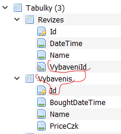

# 11 EF, data seed, propojení entit, 1:N relace

## Spojení vybavení a revizí

Nyní jsou revize a vybavení dvě nezávislé tabulky. Spojte je relací 1:N:

- Na jedno vybavení připadá několik revizí.
- Každá revize je záznamem revize právě jednoho vybavení. 
- Tento vztah vytvořte pomocí C#, EF si to přebere a vytvoří správnou databázovou relaci.

```csharp
//Vybaveni.cs
//public DateTime LastRevision { get; set; } //není potřeba, už je to ve Revizes
public List<Revize> Revizes { get; set; } = new();

//Revize.cs
public Guid VybaveniId { get; set; }
public Vybaveni Vybaveni { get; set; } = null!;
```

- Do Revizí přidejte propertu `DateTime`
- Přidejte migraci a updatujte db.

  


## Data Seed

- Do databáze se přidají testovací data.
- Jednou z metod jak je tam dostat je upravit metodu `OnModelCreating` v DbContextu

    ```csharp
    protected override void OnModelCreating(ModelBuilder builder)
    {

        Guid idVybaveniSRevizi = new Guid("aaaca371-e28b-4107-845c-ac9823893da4");
        builder.Entity<Vybaveni>().HasData(
            new Vybaveni() {Id = idVybaveniSRevizi, Name = "CT", BoughtDateTime = new DateTime(2017,6,6), PriceCzk = 100_000 },
            new Vybaveni() {Id = new Guid("111ca371-e28b-4107-845c-ac9823893da4"), Name = "MRI", BoughtDateTime = new DateTime(2015,6,6), PriceCzk = 10_000 }
            );

        builder.Entity<Revize>().HasData(
            new Revize() {Id = new Guid("bbbca371-e28b-4107-845c-ac9823893da4"), VybaveniId = idVybaveniSRevizi, Name = "Přísná revize", DateTime = new DateTime(2020,2,2) },
            new Revize() {Id = new Guid("dddca371-e28b-4107-845c-ac9823893da4"), VybaveniId = idVybaveniSRevizi, Name = "Nicmoc revize", DateTime = new DateTime(2022, 6, 22) }
            );
    }
    ```

- Musí se specifikovat i Id (normálně je db generuje sama)
- Relace mezi Revizí a Vybavením se vytvoří pomocí `VybaveniId` vlastnosti v Revizi.
- Přidejte migraci, kód pro přidání dat se propíše právě tam. Updatujte db.

## Úpravy nezbytné pro fungování apliace s propojenou revizí a vybavením
  
- Ve výpisu Vybavení (Vybaveni.razor) se bude zobrazovat datum poslední revize. Nicméně vlastnost `LastRevision` není v tabulce `Vybaveni`. Musíte ji proto získat jako poslední revizi k patřičnému objektu Vybavení. 
  - Upravujete endpoint, klient v tomto případě zůstává stejný
- Lehce upraven musí být i endpoint z získání detailu Vybavení. V detailu zobrazíte všechny patřičné revize. Je ptoto nutné vytvořit si novou třídu `VybaveniSRevizemaModel`.
- `LastRevision` ve `VybaveniModel` bude nullable. To je pro případ, že žádná revize prozatím neexistuje. 
- Musíte vhodně zobrazit neexistující revizi (tam kde to bude potřeba)
- Změny dozná soubor `VybaveniRow`, který například bude vytvářet novou revizi (a volat endpoint, který novou revizi odešle do databáze.)
  - Na každé kliknutí tlačítka Přidej Revizi se přidá jedna do databáze (s aktuálním časem)
  - Budou pak vidět na výpisu ve `VybaveniDetail`

