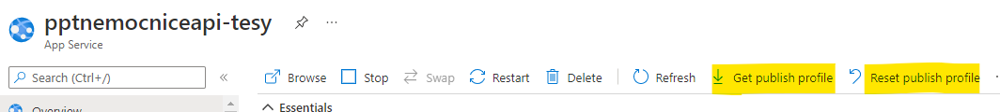
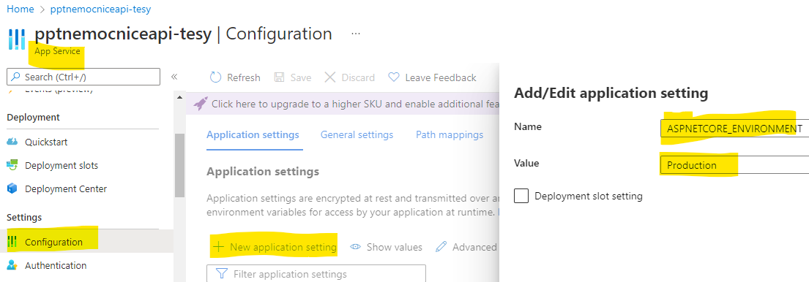

# 13 Nasazení do Azure, Logging

## Publikování aplikace do Microsof Azure

- Aktuálně nám funguje pouze publikování klientské aplikace na github pages
- Potřebujeme aby fungovala i serverová část
- Nelze využít github pages - slouží pouze pro statické soubory
- využijeme Microsoft Azure a službu App Service
- Ve finále to bude fungovat takto: pushnete změny, zahájí se 2 github actions: první pro klientskou aplikaci, druhá pro api.
  - klientská aplikace se nasadí na github pages
  - api se nasadí na azure

## Jak dostat aplikaci do Azure

- VS má celkem pěkný průvodce s téměř veškerým nastavením
  - pravým tlačítkem a dáte publish
  - může vygenerovat pubxml soubor, který obsahuje nastavení pro publikaci
    - sestavení aplikace proběhne na vašem stroji a publishnutá aplikace se "pouze" přenese.
    - Výhoda: Je to trochu rychlejší než všechny kroky pomocí gh actions. Nemusíte vytvářet commit
    - Nevýhoda: Nemusíte vytvářet commit (ztrácíte ponětí o tom, jaká verze tam je). Chvilku to trvá (nemůžete u toho vyvíjet, musíte mít zapnutý stroj). Znemožňuje to další devops..
  - Průvodce často končí nějakou chybou, navíc to ne uplně dobře komunikuje se studentským programem na Azure...
- Dá se to vzít z druhé strany (tohle je standardní cesta): Vytvořit App service na azure, spojit azure s githubem...

## Azure App Service

- vytvořte novou App service, zvolte Linux, .net 6 stack, blízkou lokaci (evropu)
- aplikaci pojmenujte rozumně dlouhým názvem (já jsem dal `pptnemocniceapi-tesy`)
  - aplikace poběží na doméně `pptnemocniceapi-tesy.azurewebsites.net`, nicméně jenom api. Touto doménou se aplikace nikde prezentovat nebude
- Chvíli to trvá, než se aplikace vytvoří

### Spárování s GH

- Nyní je třeba dostat kód, který máte na gh, do app service.
- V app service ->  Deployment Center -> Github, autorizujte aplikaci, zvolte repozitář.
- Azure app service použije přihlášení k tomu, aby přidala na GH secret s Publish profilem a vytvořila .yml soubor (a taky ho commitne a pushne)
- vytvořený .yml je dost podobný tomu který už máme.
- Soubor je potřeba upravit - upravte na gh, nebo si změny stáhněte na lokál.
  - změňte cestu na api projekt
- Nyní při pushnutí změn se spustí GH action. 
- Celá magie deploymentu je zde: 

  ```yml
  - name: Deploy to Azure Web App
        id: deploy-to-webapp
        uses: azure/webapps-deploy@v2
        with:
          app-name: 'pptnemocniceapi-tesy'
          slot-name: 'Production'
          publish-profile: ${{ secrets.AZUREAPPSERVICE_PUBLISHPROFILE_A57B35FFE54046E3862C0111DF8DA908 }}
          package: .
  ```

  - využije se akce `azure/webapps-deploy`, v publish-profile jsou všechny důležité informace k publikování (včetně tokenů pro autentifikaci)
    - proměnná `secretes` značí zabezpečené úložišt na GH (settings/secretes/actions, pro můj repo https://github.com/tesar-tech/ppt_22/settings/secrets/actions)
    - K uloženému profilu se na GH nedostanete, můžete ho pouze smazat nebo editovat.
    - Dostanete se k němu ale přes Azure

        

    - zde ho můžete stáhnout, nebo resetovat (když to uděláte, nebude fungovat ten, který je uložený na GH)
    - Díky tomuto mechanismu může být celá pipelina dostupná světu aniž by došlo k nějakému úniku přístupových údajů.
- Aplici zkuste pustit, nicméně fungovat nebude, je potřeba udělat pár úprav

## Úpravy aplikace - appsettings, ASPNETCORE_ENVIRONMENT

- Aplikace (blazor a api) jsou na sobě nezávislé. Vědí o sobě jenom tím, že:
  - api CORS dovoluje origin Blazor aplikace ("aplikaci s tímto url budu zpracovávat požadavky")
  - Blazor aplikace má nastavenou adresu api ("tu odesílej požadavky přes HTTP klienta")

### Přenastavení CORS

- Aktuálně máme CORS nastavený tak, aby propouštěl požadavky z domény localhostu: 

  ```csharp
  builder.Services.AddCors(corsOptions => corsOptions.AddDefaultPolicy(policy =>
      policy.WithOrigins("https://localhost:7132")
  ```

- Nicméně klientská aplikace nám běží na github doméně `https://tesar-tech.github.io`
- Jak rozlišit, že je aplikace nasazená (a povolit origin githubu.io) nebo, že je ve vývoji a povolit origin localhostu? 
- Aplikace to dokáže rozlišit pomocí `ASPNETCORE_ENVIRONMENT`. Napříkad zde:
  - swagger použijeme jenom při vývoji

    ```csharp
    if (app.Environment.IsDevelopment())
    {
        app.UseSwagger();
        app.UseSwaggerUI();
    }
    ```

- Jak aplikace pozná, že je v `Development`?
  - řekli jsme jí to v launchSettings.json :  `"ASPNETCORE_ENVIRONMENT": "Development"`
  - dalším prostředím je `Staging` a `Production`.
- Nasazené aplikaci "vnutíme" Production.
  - launchSetting.json se při publikování aplikace na server nedostane
  - řekneme jí to v Azure s pomocí konfigurace (tento krok dělat nemusíme, jelikož `Production` je [defaultním nastavením](https://docs.microsoft.com/en-us/aspnet/core/fundamentals/environments?view=aspnetcore-6.0#azure-app-service))
    
  - Nyní můžeme používad odbočku `app.Environment.IsProduction()`
  - Nicméně je lepší používat appsettings.json konfiguraci:

### appsettings.json

- v api projektu vidíte soubor appsettings.json a appsettings.Development.json
- Fungují tak, že dle prostředí se použije dané nastavení (například Development) a když některé nastavení není v Development, použije se to z appsettings.json.
- Tedy do appsettings.json dáváte konfiguraci, která je nezávislá na prostředí.
- Vytvořte produkční app settings a umístěte tam konfiguraci AllowedOrigin s hodnotou vaší github pages domény. (origin je bez cesty a lomítka na konci)
- To stejné udělejte pro development.
- Konfiguraci si v Program.cs vyzvednete pomocí: `builder.Configuration["AllowedOrigins"]`
  - vyzkoušejte, že vám to funguje

### Přenastavení adresy api na klientovi

- Stejný "problém" s natvrdo vepsaným nastavením máme i na straně klienta.
- Nastabujeme zde URI pro komunikaci s api.
- přidejte `appsettings.json` (a jeho `Development` a `Production` varianty) do `wwwroot` složky.
  - přidejte patřičné nastavení. 

- Otestujte aplikace, poté je pushněte...

## Databáze

- Zde už narážíme na limity SQLite databáze. Nejjednodušší je přenést celou databázi, avšam musíme nejdřív dotnetu sdělit, že databázový soubor je součástí aplikace

  ```xml
  <ItemGroup Condition="'$(Configuration)'=='Release'" >
	  <None  Update="Nemocnice.db"  >
	    <CopyToOutputDirectory>Always</CopyToOutputDirectory>
	</None>
 </ItemGroup>
  ```

- v případě, že je konfigurace Release (což je, když aplikaci připravuje pipelina), tak se Nemocnice.db během buildu zkopíruje. 
  - pak se přenese se s ostatními soubory.
- db zmizí při každém nasazení aplikace.
  - dalo by se to řešit použitím file storage v azure
- Pro real-world aplikace je lepší použít databázový server 
  - (v tomto případě to neděláme, jelikož by to potřebovalo dalších několik minut nastavování )
- Musí se potom řešit migrace databáze.

## Některé nedostatky

- Popsané problémy s sqlite databází.
- Build a nasazení aplikací je nezávislý proces. Může to dojít do nešťastné chvíle, kdy se změny projeví jen v jedné aplikaci. Druhá se kvůli chybě třeba nesestaví.
  - Máme pak api nekompatibilní s klientskou aplikací do doby, než problém vyřešíme. To je špatně.
- Měl by existovat Staging. Stejná aplikace (se stejným nasatavením) na azure s vlastní databází, kde se celý proces otestuje.
- Mělo by existovat víc větví, než jen jedna (master). Jedna zvlášť na vývoj, na testování, různé verze atd...
- Aplikace by měla obsahovat automatizované testování. Testy se pak spouští před každým nasazením aplikace, díky tomu se odhalí část problémů (které by se jinak odhalili až za běhu).
  - Se složitostí aplikace roste potřeba testů (vývojáři si přestávají pamatovat co kde je s čím propojené a co se kde v důsledku této a této změny může pokazit...)
  - K tomu jsem se bohužel v předmětu nedostali.
- Aktuálně využívaná App service na azure startuje pomalu. Aplikace běží zdarma a jedním z omezení je i pomalý studený start..

## Logging

- Způsob jakým zachytit, co se v aplikaci děje
- Už ho používáte -> jsou to ty výpisy v konzoli
- Využívá se asp.net core logging, ale existují i jiné (NLog,Log4Net, Serilog)
- Konzole je jedna z "výevek" (sink), ostatní můžou být: databáze, soubor, debug okno ve vs, Azure Blob storage, Azure app insights,..
- Logger už je přidátn (jako spoustu defaultních věcí v `WebApplication.CreateBuilder(args);`)
- Využití: 

  ```chsarp
  _logger.LogWarning("varování, právě jsem něco zalogoval 🚨")
  ```

- Různé úrovně (trace, debug, info, warning, error, critical)
- Nastavení v appsetting.
- Vytvořte log v kontrolerech. Například -> "Byla přidána revize.."

## dú:Doktoři

Implementujte následující

- Přidejte tlačítko "přidej revizi" na detail vybavení (stejná funkcionalita jako v seznamu vybavení)
- Zamezte přidávání úkonu u vybavení, které má revizi starší než 2 roky.
  - Zamezit tomu musíte na serveru i na klientovi.
  - Implementujte to tak, aby v případě starší revize a nemožnosti přidat úkon bylo tlačítko (nebo odkaz) neaktivní s patřičnou hláškou.
    - V případě, že se přidá čerstvá revize, tlačítko se zaktivní ihned (bez nutnosti obnovit stránku).
    - V případě, že se chyba odhalí až na serveru, vraťte patřičný http kód s patřičnou chybou..
      - (můžete to pak otestovat ve swaggeru, kde vám nebude "překážet" zamezující implementace na klientovi)