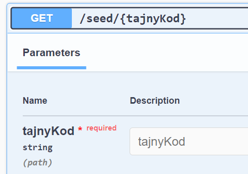
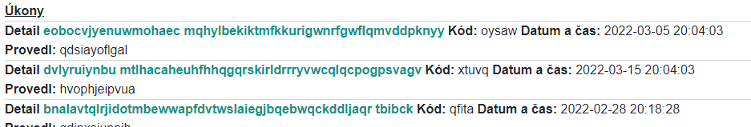

14 - test 02

## Komentář k úkolu 13

- Lehký problém s přidáváním revizí je ten, že datum revize (podle kterého se určuje možnost a nemožnost přidat úkon)
se určuje na serveru. Musíme si tedy vytvořené datum poslat při vytvoření revize zpět. Více v komentáři v post /revize a v souboru `RevizeModel.cs`
  - dalo by se to obejít tím, že po vytvoření revize se tam na klientu přidá aktuální datum. Nemožnost úkonu je ve 2 letech, takže pár nepřesných sekund skutečně není problém.
  navíc se nemožnost úkonu kontroluje ještě na serveru
- Kontrola na serveru probíhá v post /ukon, jednoduše se vytáhnou všechny revize k vybavení a zkontroluje se ta nejmladší.

## Zadání - test 02 - Pracovníci

### [0.3] Tabulka pracovníků

Přidejte tabulku pracovníků

- Pracovníci jsou zodpovědní za úkon. Například: Radiologický asistent, který provedl CT vyšetření. Doktor, který při operaci využil elektrokauter.
- Vždy pouze jedna osoba na daný úkon
- Stále je však možné mít úkon bez pracovníka

### [0.3] Endpoint seed

Použijte a zprovozněte implementaci endpointu `seed` k naplnění databáze (jeho implementace je dole ↓).

- Co seed dělá: Vytváří jistý počet pracovníků. Poté projde všehno vybavení a ke každému přidá náhodný počet úkonů. Ke každému úkonu přidá náhodně pracovníka.
- K dispozici máte tělo metody. Musíte vymyslet její hlavičku, tak aby to dalo dohromady následující endpoint:

      

- Upravte endpoint tak aby vám fungoval. Povolené úpravy jsou pouze změna názvu tříd a změna názvu vlastností.
  - (můžete si tímto ověřit, jestli máte správně strukturu Pracovník-Úkon-Vybavení)
- Udělejte nezbytné úpravy (jinde v kódu), tak aby se seed nedal spustit na nasazené aplikaci (ale v prostředí Development ano).
- proměnná `config` je typu `IConfiguration` a už je přidána v kontejneru.
- seed spusťte.

### [0.3] Pracovník do výpisu úkonů

Přidejte pracovníka (stačí jeho jméno) do výpisu úkonů.

- Na vhodném místě budete muset použít metodu `ThenInclude` (používá se tam, kde chceme includnout na entitě, která je již inlcudnutá)
- Nepotřebujete vytvářet `PracovnikModel`, stačí když na vhodné místo přidáte propertu `PracovnikName`, automapper to pochopí...

### [0.1] Detail úkonu ve výpisu bude v odstínu zelené barvy. 

    

## Kód k zadání

```csharp
{
    if (tajnyKod != config["seedSecrete"])
        return Results.NotFound();

    Random rnd = new();
    List<Pracovnik> pracanti = new();
    int pocetPracantu = 10;
    for (int i = 0; i < pocetPracantu; i++)
        pracanti.Add(new() { Name = RandomString(12) });

    db.AddRange(pracanti);db.SaveChanges();

    foreach (var vyb in db.Vybavenis)//pro každé vybavení
    {
        int pocetUkonu = rnd.Next(13,25);
        for (int i = 0; i < pocetUkonu; i++)//se vytvoří několik úkonů
        {
            Ukon uk = new() { 
                DateTime = DateTime.UtcNow.AddDays(rnd.Next(-100, -1)), 
                Detail = RandomString(56).Replace("x", " "),
                Kod = RandomString(5),VybaveniId = vyb.Id,//daného vybavení
                PracovnikId = pracanti[rnd.Next(pocetPracantu-1)].Id };
            db.Ukons.Add(uk);
        }
    }
    db.SaveChanges();

    return Results.Ok();

   string RandomString(int length) =>//lokální funkce
       new(Enumerable.Range(0, length).Select(_ => (char)rnd.Next('a', 'z')).ToArray());
}
```
